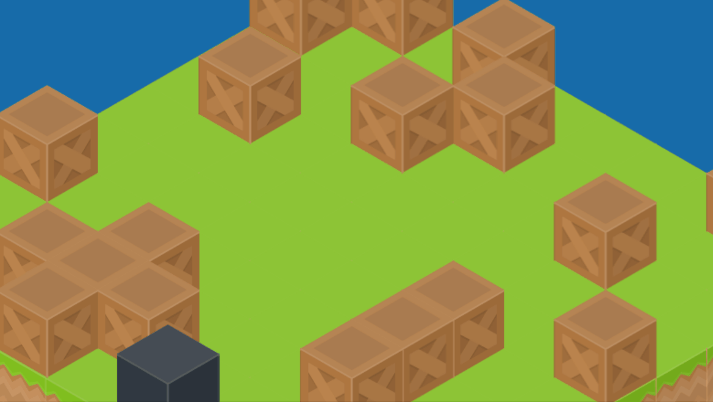

## Isometric Layers Demo

This demo shows how to build isometric tile map layering with elevation/z-index!



Read my blog post! 

Assets from Kenny.nl https://kenney.nl/assets/isometric-blocks

### Running locally

* Install nodejs

* On the command line run
    ```
    > npm install
    > npm run start
    ```